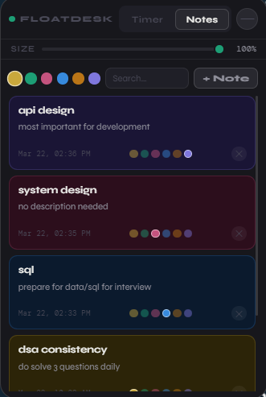
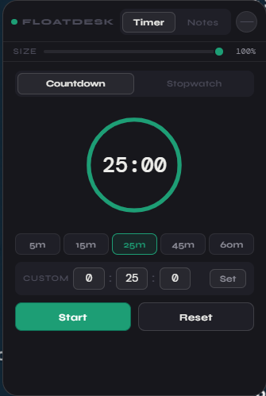

# 🚀 FloatDesk v2 — Floating Timer & Sticky Notes

A **minimal, always-on-top productivity widget** that stays in your workspace without getting in your way.

Perfect for **deep work, DSA prep, interviews, and daily planning**.

---

## 🖼️ Demo

### 📝 Notes Panel


### ⏱️ Timer Panel


> Place your images inside an `assets/` folder:
> - `assets/demo-notes.png`
> - `assets/demo-timer.png`

---

## ✨ Features

### ⏱️ Timer & Productivity
- Countdown timer with presets: **5 / 15 / 25 / 45 / 60 min**
- Custom time input (h:mm:ss)
- Stopwatch with lap tracking
- Animated **progress ring**
  - 🟡 Amber at 20% remaining  
  - 🔴 Red + pulse at completion

### 📝 Sticky Notes
- Persistent notes (saved locally)
- 6 color themes: Yellow, Teal, Pink, Blue, Amber, Purple
- Live search (title + content)
- Edit & recolor notes anytime

### 🧠 UX Features
- Always-on-top (even over fullscreen apps*)
- Drag anywhere on screen
- Resize dynamically (75% → 140%)
- Minimize to **floating pill mode**
- System tray support (show/hide/quit)

---

## ⚙️ Requirements

- Windows 10 / 11 (64-bit)
- Node.js 18+
- npm 9+

```bash
node --version
npm --version
